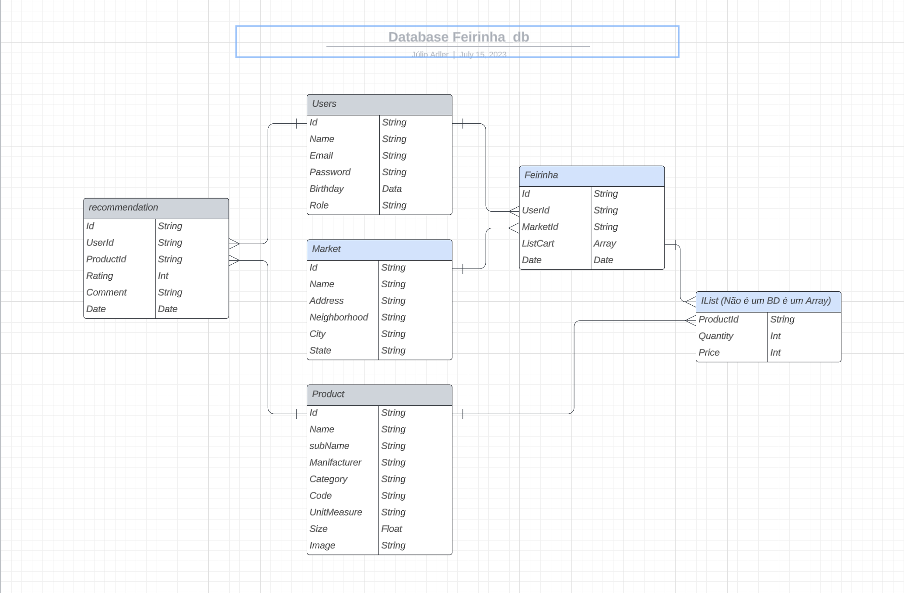

# PROJECT FEIRINHA

# Contexto
Este projeto trata-se de uma Aplicação FullStack para Listar, Organizar, Precificar e Acompanhar suas Listas de Feiras em Super-mercados.

Nele é possível:
- Registrar-se como novo usuário e Logar em sua Conta.
- Criar uma pré-lista de feirinha para lembrete.
- Cadastrar Produtos Durante a compra (registrando o código de barras).
- Cadastrar Mercados.
- Ter registro histórico de preços por produto e por mercado.
- Estatísticas históricas feirinhas.
- Sugestão de Economia com base em histórico passado.

> Técnologias usadas

Front-end:
* Desenvolvido usando: Next.js, React, Context, CSS3, HTML5, TailWind, TypeScript, Axios.

Back-end:
* Desenvolvido usando: NodeJS, ExpressJS, MongoDB, Mongoose, ES6, TypeScript, JWT, Bcrypt, Docker.


## Inicializando o Projeto

  <details><summary>Instalando Dependências</summary>

    > Backend
    ```bash
    cd backend/ 
    npm install
    ``` 
    > Frontend
    ```bash
    cd frontend/
    npm install
    ``` 
  </details>

  <details><summary>Executando aplicação</summary>

    * Para rodar o back-end:

      ```
      cd backend/ && docker-compose up -d --build
      && docker exec -it feirinha_api bash
      ```
    * Para rodar o front-end:

      ```
        cd frontend/ && npm start
      ```
  </details>

## Testes
  <details><summary>Executando Testes de Integração</summary>

    * Para rodar todos os testes:

      ```
        npm test
      ```
  </details>

# Banco de Dados
  <details><summary>Estrutura de Dados no Mongo</summary>

    
  </details>

# Requisitos do Projeto
## Requisitos e funcionalidades do Back-End
> Rota USER

  <details><summary>01 - POST /user - Criar novos Usuários:</summary>

  ``` 
  {
    "name": "string",
    "email": "string",
    "password": "string",
    "birthday": "string",
    "role": "string"
  }
  ```

    - O SUPER é auto-criado ao inserir o primeiro USER.
  </details>

  <details><summary>02 - POST /login - Fazer login:</summary>

  ``` 
  {
    "email": "string",
    "password": "string"
  }
  ```

    - Gera Token e salva nos Headers da requisiçao.
  </details>

  <details><summary>03 - PUT /user - Atualiza informações dos usuários:</summary>

  ``` 
  {
    "id": "String",
    "...": "..."
  }
  ```
    - Basta passar o ID do usuário e as informações que você quer alterar.
    - O usuário SUPER só pode ser editado por ele mesmo | Impossível mudar a ROLE do SUPER.
    - Os USERs não podem mudar suas próprias ROLEs, apenas informações pessoais.
    - Só o SUPER pode dar ADMINs.
  </details>

  <details><summary>04 - DELETE /user - Deletar Usuários:</summary>

  ``` 
  {
    "id": "String"
  }
  ```

    - O SUPER pode deletar todos menos a si mesmo.
    - Os ADMINs podem deletar os USERs e outros ADMINs.
    - Os USERs podem apenas se DELETAR, mas não a outros USERS.
  </details>

  <details><summary>05 - GET /user - puxa algumas informações dos usuários:</summary>

  retorno: 
  ```
  [
    {
      "id": "String",
      "name": "String",
      "email": "String",
      "role": "String"
    },
    {
      "..."
    }
  ]
  ```

    - Apenas Admins e Super podem listar usuários.
  </details>

> Rota PRODUCT

  <details><summary>01 - POST /product - Cadastrar um novo produto:</summary>

  ``` 
  {
    "name": "string",
    "subName": "string,
    "manufacturer": "string",
    "category": "string",
    "code": "string",
    "unitMeasure": "string",
    "size": "number",
    "image": "string"
  }
  ```
    - O name deve vir com a descrição genérica ex: 'Macarrão'.
    - O subName deve ser uma descrição mais detalhada ex: 'Espaguete'.
    - A imagem deve vir a rota de onde ela foi salva.
    - Qualquer pessoa pode cadastrar um novo produto.
    - o Código de barras será lido pelo front e automáticamente mandado para o backend.
  </details>

  <details><summary>02 - PUT /products - atualizar um produto:</summary>

  ```
  {
  "id": "String",
  "...": "..."
  }
  ```
    - Basta passar o ID do produto e as informações que quer alterar.
  </details>

  <details><summary>03 - GET /product - puxa todos os produtos:</summary>

  retorno: 
  ```
  [
    {
      "id": "String",
      "name": "String",
      "subName": "String",
      "manufacturer": "String",
      "category": "String",
      "code": "String",
      "unitMeasure": "String",
      "size": "Number",
      "image": "String"
    }
  ]
  ```
  </details>

  <details><summary>04 - DELETE /product - deleta um produto do banco:</summary>

  ``` 
  {
    "id": "String"
  }
  ```
    - Apenas Admins e Super podem deletar produtos.
  </details>
